# Настройка и подключение проверки сонаром к проекту

## Содержание

- [Настройка и подключение проверки сонаром к проекту](#настройка-и-подключение-проверки-сонаром-к-проекту)
  - [Содержание](#содержание)
  - [Настройка сервера](#настройка-сервера)
    - [Установка branch плагина](#установка-branch-плагина)
    - [Интеграция sonar и gitlab](#интеграция-sonar-и-gitlab)
    - [Добавление ~~агента~~ runner'а на новый ПК](#добавление-агента-runnerа-на-новый-пк)
      - [Установка библиотек](#установка-библиотек)
      - [Установка сканера](#установка-сканера)
      - [Установка ранера gitlab](#установка-ранера-gitlab)
      - [Установка edt](#установка-edt)
  - [Настройка проекта в sonar](#настройка-проекта-в-sonar)
  - [Новые проекты для анализа](#новые-проекты-для-анализа)
  - [Регистрация существующего runner'а в новом проекте](#регистрация-существующего-runnerа-в-новом-проекте)
  - [Подготовка проекта в gitlab](#подготовка-проекта-в-gitlab)
    - [Параметры проекта](#параметры-проекта)
      - [Описание параметров](#описание-параметров)
      - [Добавление параметров через проект](#добавление-параметров-через-проект)
  - [Результат](#результат)

## Настройка сервера

### Установка branch плагина

- [Плагин](https://github.com/mc1arke/sonarqube-community-branch-plugin). Или берем из нашего [репо](https://gitlab.com/Konstanta/common/sonarqube-community-branch-plugin/-/releases) (поправлено оформление MR).
- Скачиваем. Распаковываем. Ставим по инструкции (раздел `Manual Install`). Перезапускаем
- не забываем прописать пути из разделов `Global configuration` и `Serving images for PR decoration` что бы картинки подтягивались и ссылочки работали

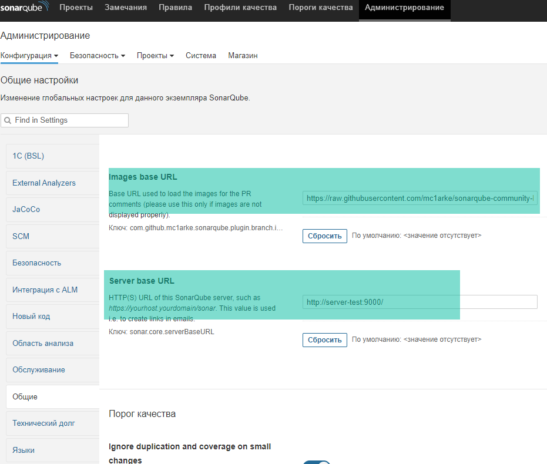

- Глобально защищаем долгоживущие ветки от удаления (можно переопределить в проекте)

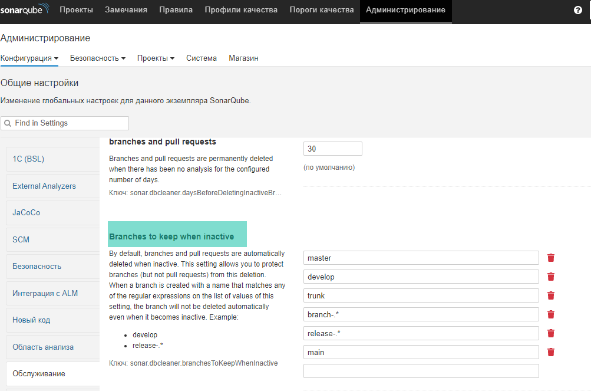

### Интеграция sonar и gitlab

- В sonar переходим в раздел `Администрирование` - `Общие настройки` - `Интеграция с ALM`. Выбираем гитлаб. Нажимаем `создать конфигурацию`

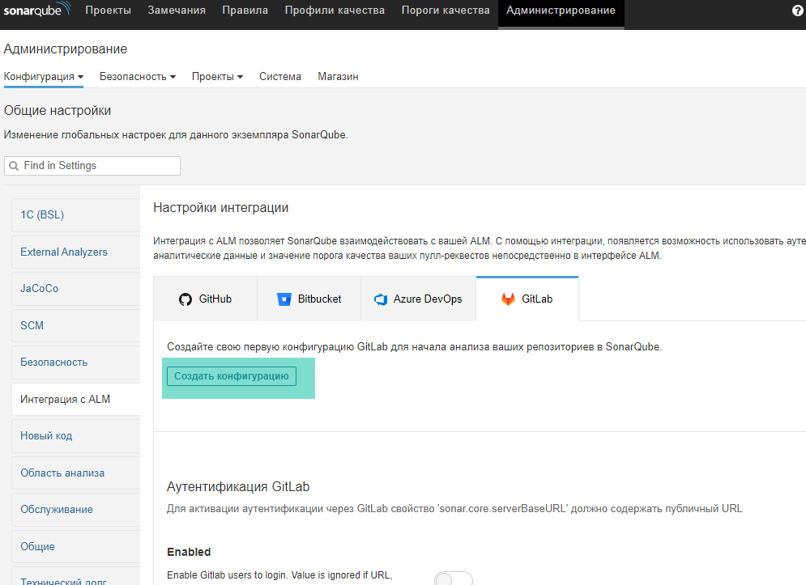

- заполняем поля

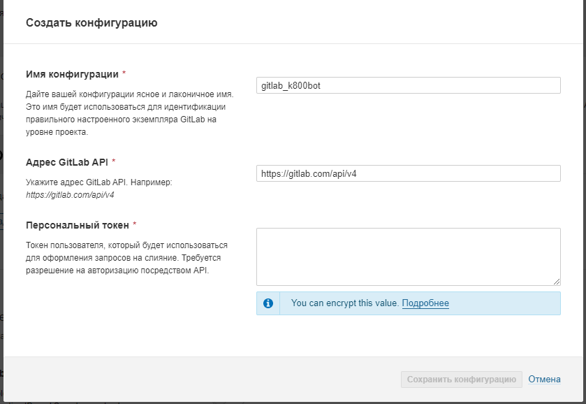

- для формирования токена переходим в gitlab `Настройки пользователя` - `Токены доступа`. Ставим галки `api`, `read_api`. Нажимаем `создать личный токен доступа`

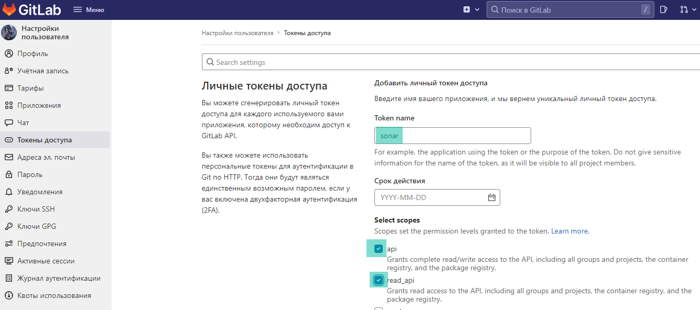

- копируем токен, вставляем в соответствующее поле в сонаре, нажимаем `сохранить конфигурацию`
- увидим зеленые галочки, если нет ошибок

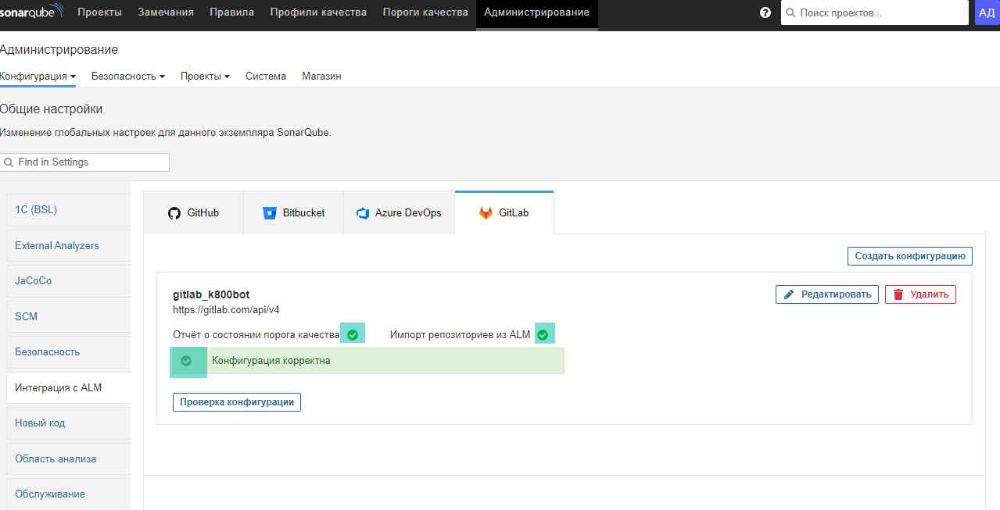

- Включаем `Enebled`, заполняем `GitLab URL`, `Application ID`, `Secret`
- Для заполнения `Application ID`, `Secret` нужно создать приложение в gitlab. `Настройки пользователя` - `Приложения`
  - Указываем `Redirect URI`
  - Проставляем доступ `api`, `read_api`, `read_user`, `sudo`
  - `Сохранить приложение`

```text
http://gitlab.com/import/gitlab/callback
http://gitlab.com/users/auth/gitlab/callback
http://server-test:9000/oauth2/callback/gitlab
```

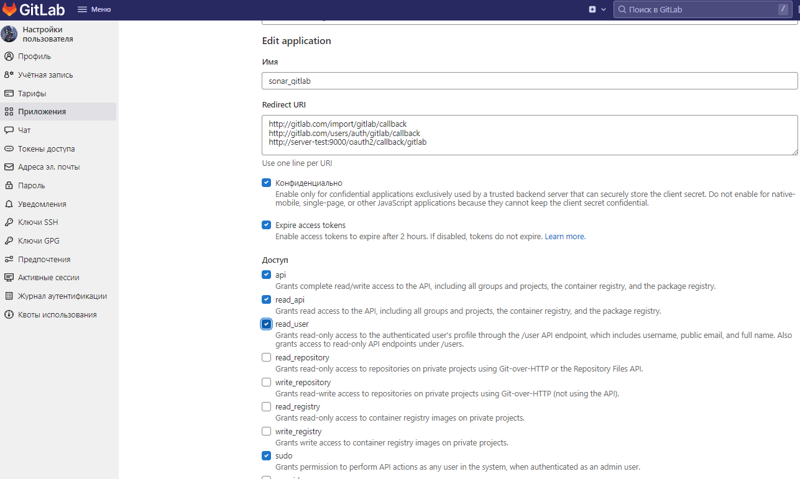

- копируем `Идентификатор приложения` в `Application ID`. `Secret` в `Secret`
- выходим из учетки в sonar. Заходим заново с помощью gitlab

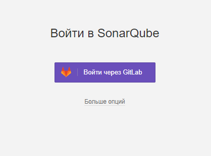

- если у пользователей совпадает email, то будет ошибка. У старого аккаунта почту надо подчистить

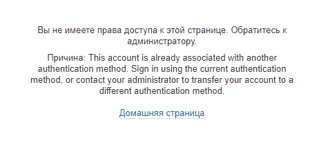

- Если для коммита используется другой email, то указываем его. `Администрирование` - `Безопасность` - `Пользователи`. У конкретного пользователя `Настройки` - `Обновить подробности`

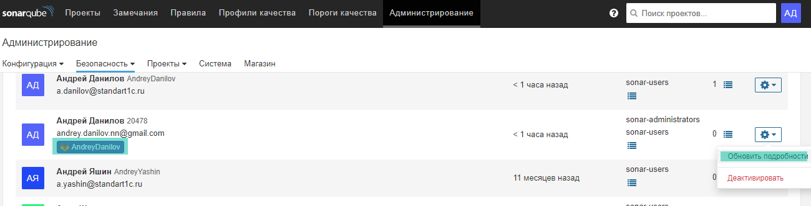

- Добавляем email'ы используемые для коммитов. Предварительно у дублирующего аккаунта его надо очистить  

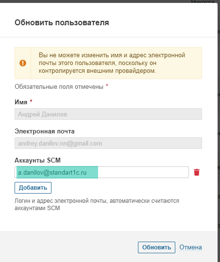

- Старого пользователя можно удалить (если есть токены, то их нужно пересоздать)

### Добавление ~~агента~~ runner'а на новый ПК

#### Установка библиотек

- Установить oscript. Прописать в path в **системные переменные** путь к папке `bin`. При установке из мастера он это делает сам.
- Выполнить скрипт установки/обновления библиотек [InstallUpdateOs.bat](/sonar/InstallUpdateOs.bat)

#### Установка сканера

- качаем распаковываем [сканер](https://docs.sonarqube.org/latest/analysis/scan/sonarscanner/)
- прописываем в системные переменные среды путь к `bin`. **Важно! Именно в системные, а не для пользователя.**

#### Установка ранера gitlab

- обновляем powershell `winget install Microsoft.PowerShell` [статья](https://stackoverflow.com/questions/68050125/gitlab-runner-prepare-environment-failed-to-start-process-pwsh-in-windows)
- [скачиваем, устанавливаем](https://habr.com/ru/company/rostelecom/blog/546702/#gitlab_runner_install) (не забываем переименовать в gitlab-runner) `gitlab-runner.exe install`
- регистрируем в проекте `gitlab-runner.exe register`
- стартуем `gitlab-runner.exe start`
- все ок, если ранер появился и горит зеленый кружок

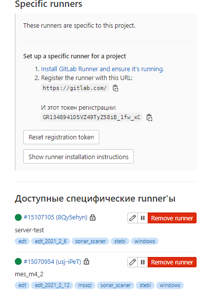

- если не горит значит не стартанули раннер (если регистрируется запущенный ранер, то его надо перезапустить)

#### Установка edt

- устанавливаем оффлайн
- серверная java в инструкции прописана не корректно (падает ring). Прописать

```ini
-vm
C:\Program Files\BellSoft\LibericaJDK-11-Full\bin\javaw.exe
```

## Настройка проекта в sonar

- `Проект` - `Настройки проекта` - `Общие настройки`

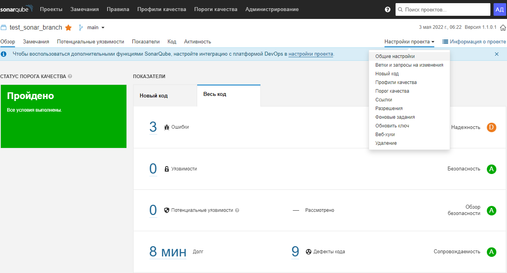

- `Обслуживание`. Если требуется переопределяем защищенные ветки. Указываем время жизни веток
- `Интеграция с платформой DevOps`. `Имя конфигурации` - указываем имя конфигурации gitlab (см. `Интеграция sonar и gitlab`). `Идентификатор проекта` - указываем `ID проекта` из gitlab. Без этой настройки MR не будет оформляться
- `Проект` - `Настройки проекта` - `Новый код`.
- `Настройки проекта` - `Определить специфические настройки для этого проекта` - `Базовая ветка`

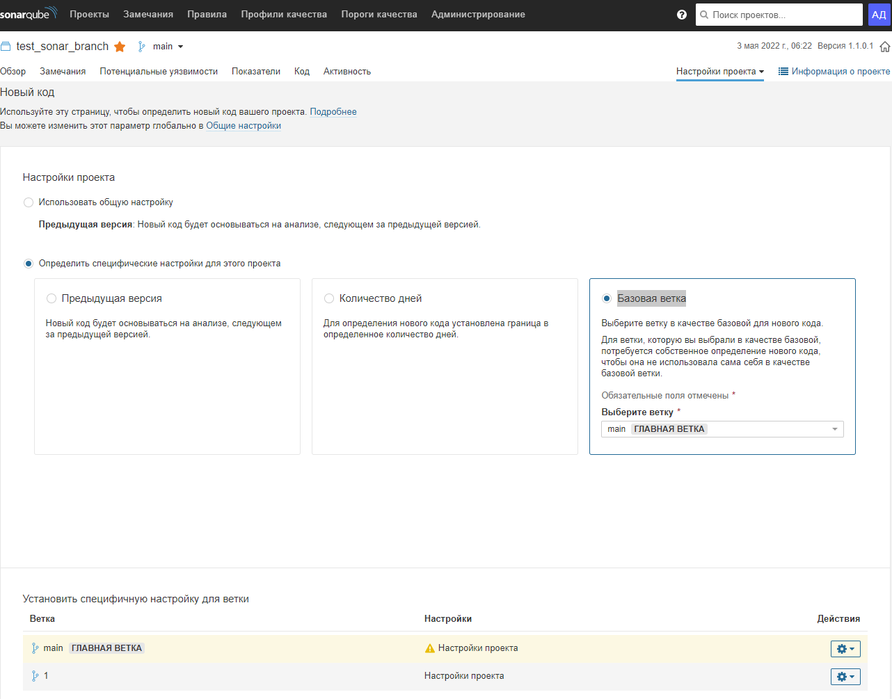

- т.к. настройка не совместима с главной веткой для нее нужно задать отдельную настройку. `Действия` -  `Редактировать`

## Новые проекты для анализа

- новые проекты лучше заводить через `Создать проект` - `gitlab` в sonar

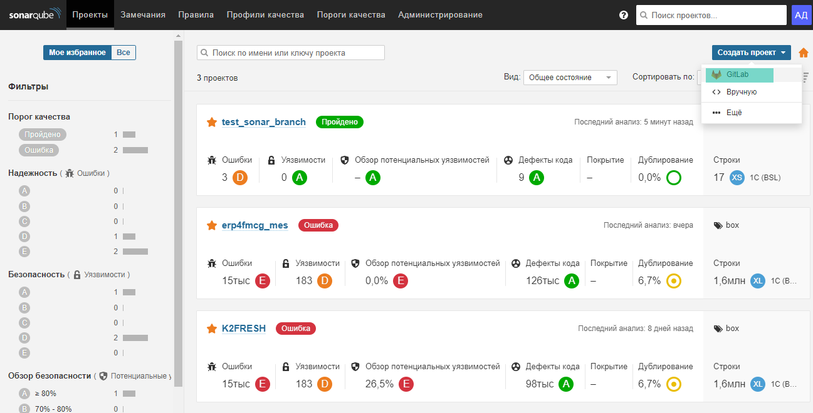

## Регистрация существующего runner'а в новом проекте

- так же как при установке. Только регистрируем с данными нового проекта
- раннер надо перезапустить `gitlab-runner.exe restart` (консоль от админа)
- если в процессе регистрации забыли проставить соответствующие теги, то можно потом проставить в проекте

## Подготовка проекта в gitlab

- скопировать и закомитить в корень проекта файл [.gitlab-ci.yml](/sonar/ПоложитьВКореньПроекта/.gitlab-ci.yml)
- скопировать, настроить и закомитить в корень проекта файл [.project-settings.json](/sonar/ПоложитьВКореньПроекта/.project-settings.json)
- скопировать `.bsl-language-server.json` из репо [`dev-settings`](https://gitlab.com/Konstanta/common/dev-settings/-/blob/main/bsl-ls/.bsl-language-server.json)
- `проект` - `Основные Настройки`- `Запросы на слияние`. 
  - Включить галку `Все дискуссии должны быть завершены`
  - По желанию можно еще `Сборочные линии должны успешно выполниться`

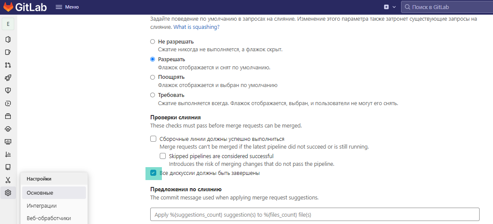

- `проект` - `ci/cd`- `Сборочные линии`
  - `Файл конфигурации CI/CD` указать `.gitlab-ci.yml` (или оставить пустым. Пустое поле означает, что будет использоваться `.gitlab-ci.yml`)
  - `Git strategy` - `git fetch`
  - `Поверхностное клонирование Git` - `пусто`
  - по желанию можно указать таймаут
  - сохранить изменения

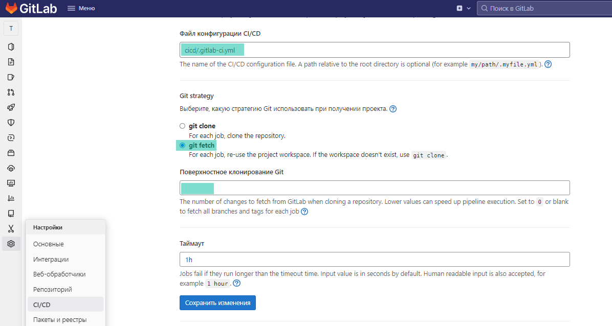

- `проект` - `ci/cd`- `Runner'ы`
  - проверить что есть доступные зарегистрированные ранеры
  - проверить что раннер запущен - зеленый кружок.
  - проставить (карандашик) соответствующие установленному софту метки на ранере. Наличие меток `sonar_scaner`, `stebi`, `windows` обязательно.

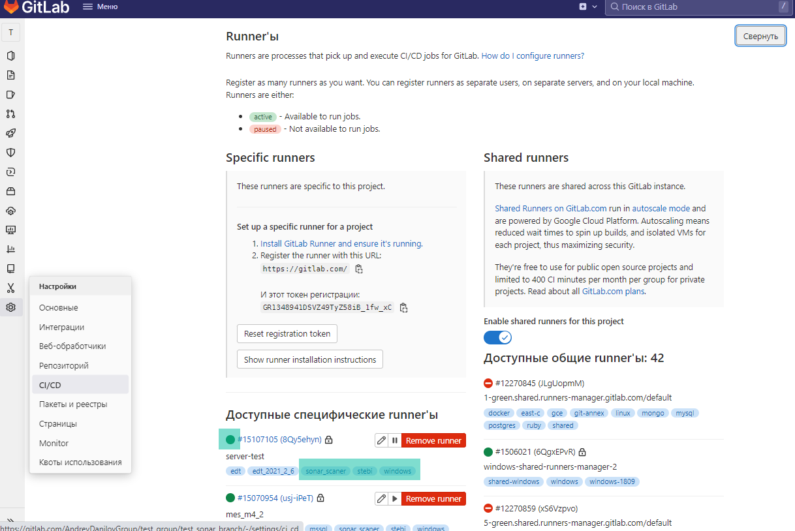
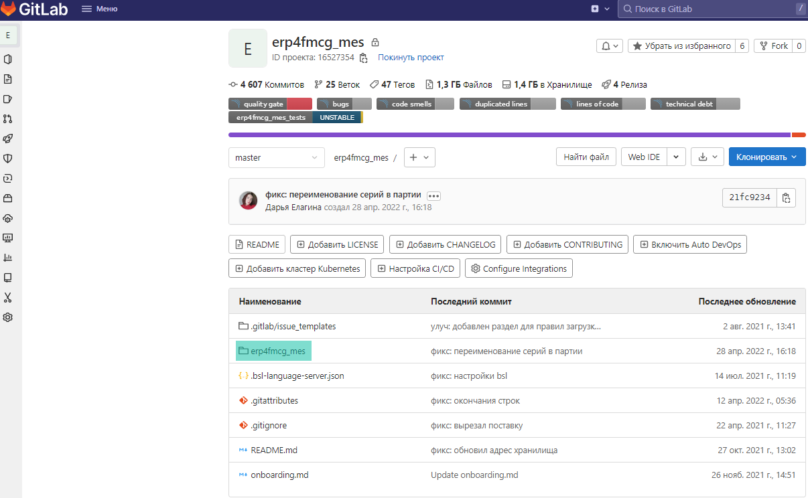

### Параметры проекта

Значение параметров получаются в 3 этапа:

1. Значения заполняются значениями по умолчанию
2. Значения заполняются из параметров проекта, если они там указаны
3. Значения заполняются из файла параметров `.project-settings.json`, если они там указаны

Значения из файла параметров `.project-settings.json` имеют наивысший приоритет.

#### Описание параметров

| В параметрах                  | В файле                        | Значение по умолчанию             | Описание                                                 |
| ---------                     | ---------                      | ---------                         | ---------                                                |
| `PROJECT_CATALOG`             | `ProjectCatalog`               | <Нет>                             | Имя папки проекта                                        |
| `SONAR_TOKEN`                 | <Нет>                          | <Нет>                             | Токен пользователя в Сонаре                              |
| `SONAR_HOST_URL`              | `HostUrl`                      | `http://server-test:9000`         | Адрес сервера Сонара                                     |
| `PROJECT_NAME`                | `ProjectName`                  | Имя проекта из ГитЛаба            | Имя проекта в Сонаре                                     |
| `PROJECT_KEY`                 | `ProjectKey`                   | "project_" + ИД                   | Уникальный идентификатор проекта в Сонаре                |
| `EDT_CHECK`                   | `EDT_Check`                    | `false`                           | Выполнять ли проверку с помощью ЕДТ                      |
| `EDT_VERSION`                 | `EDT_version`                  | "2021.2.6"                        | Версия ЕДТ для проверки                                  |
| `DEBUG_SCANNER`               | `Debug_Scanner`                | `false`                           | Флаг для вывода отладочных сообщений от Сонар-Сканера    |
| `DEBUG_CI`                    | <Нет>                          | `false`                           | Флаг для вывода отладочных сообщений от скриптов         |
| `GENERIC_ISSUE_SETTINGS_JSON` | `ExternalIssuesReportSettings` | `.\gitlab_ci\sonar\settings.json` | Файл настроек конвертации правил от ЕДТ в правила Сонара |

#### Добавление параметров через проект

- `проект` - `ci/cd`- `Переменные`
- добавить переменные. **Важно! Убрать галку `Защищенная`**

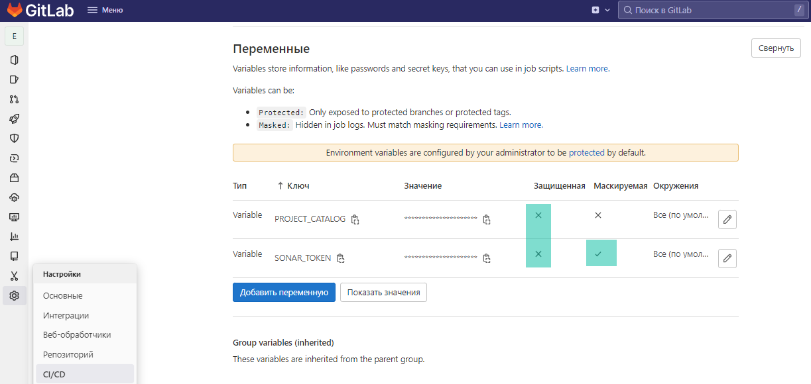

- `PROJECT_CATALOG` - имя папки проекта. Например:

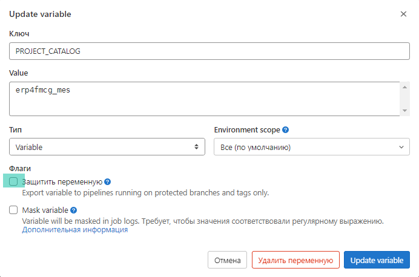


- `SONAR_TOKEN` - токен пользователя в sonar


- Можно добавить переопределяющие параметры:
  - `SONAR_HOST_URL` - адрес сервера sonar
  - `PROJECT_NAME` - имя проекта в sonar
  - `PROJECT_KEY` - идентификатор проекта в sonar
  - `EDT_CHECK` - если `true`, то выполняетcя валидация проекта при помощи edt (требуется установка edt)
  - `EDT_VERSION` - версия edt под которой будет происходить валидация
  - `DEBUG_SCANER` - если `true`, то сканер спамит отладочными сообщениями

**ВАЖНО! Флаги "Защитить переменную" должен быть снят для всех параметров.**

## Результат

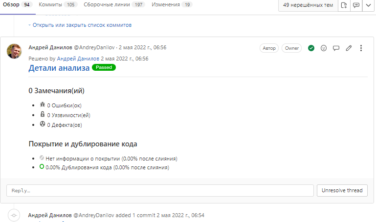

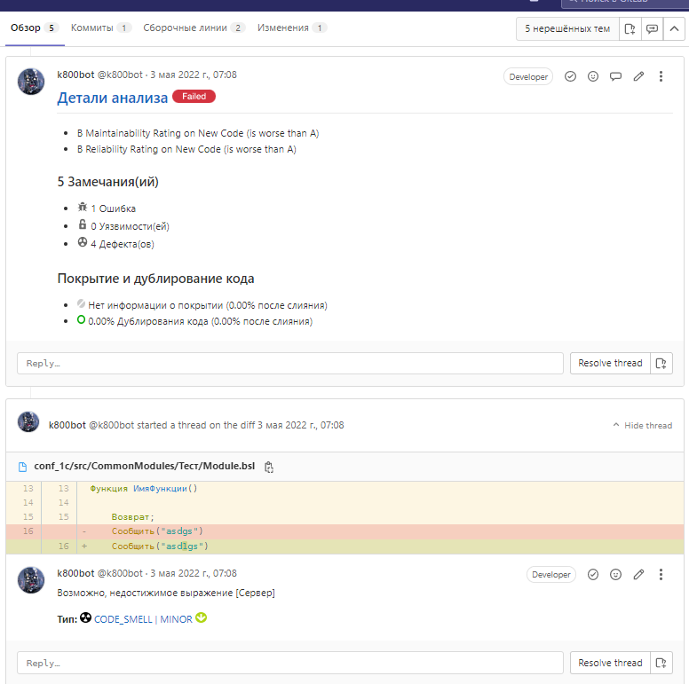


